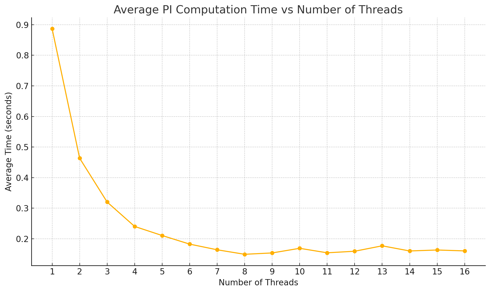
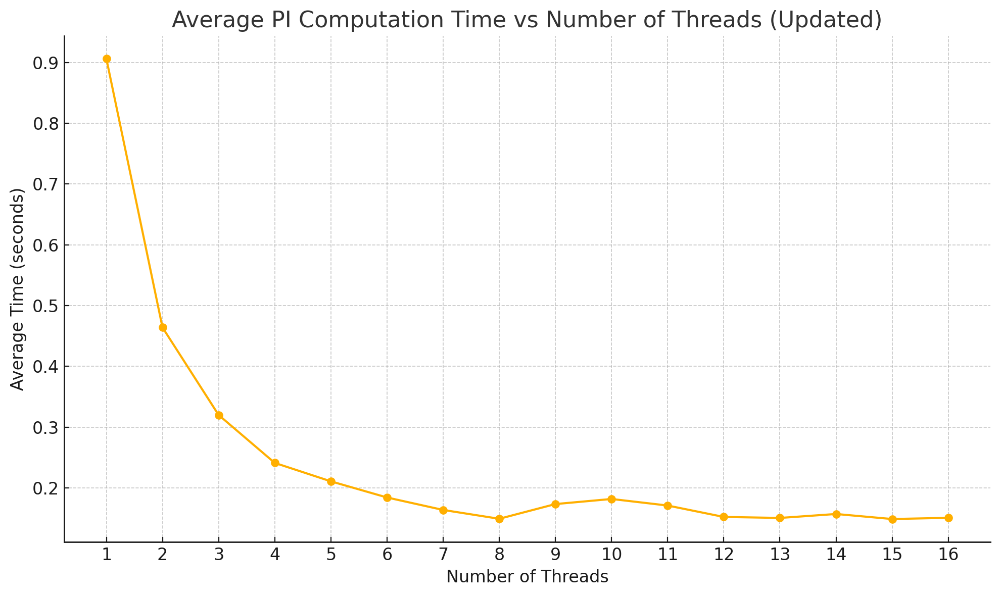
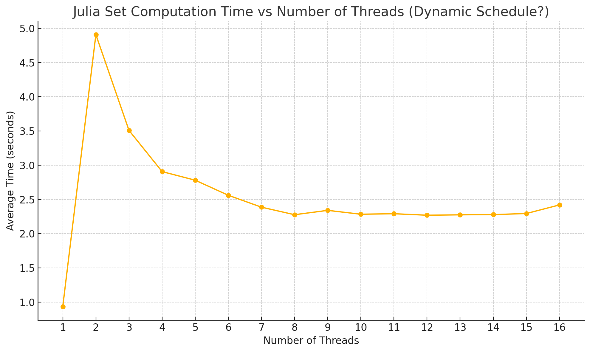
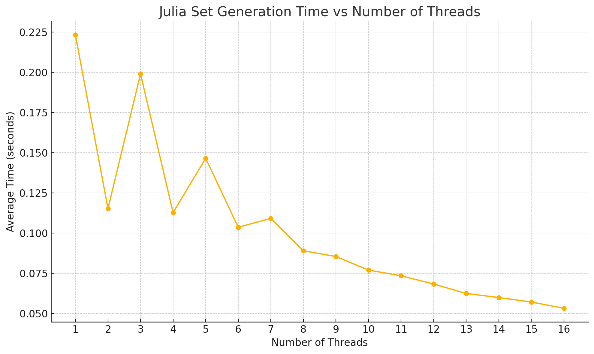
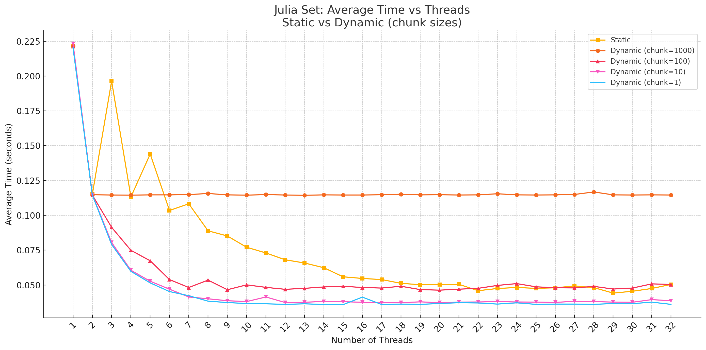

# Parallélisme intra-processeur – OpenMP 

## Exercice 1 – Prise en main 
 
### Déterminer le nombre de coeurs de votre architecture, quelle est leur fréquence d'horloge : cat /proc/cpuinfo sous Linux ou bien le gestionnaire de tâches et de périphériques sous Windows.

```
(base) williambogdanovic@Williams-MacBook-Air archi_parall % sysctl -a | grep cpu
kern.sched_rt_avoid_cpu0: 0
kern.cpu_checkin_interval: 5000
hw.ncpu: 8
hw.activecpu: 8
machdep.cpu.cores_per_package: 8
machdep.cpu.core_count: 8
machdep.cpu.logical_per_package: 8
machdep.cpu.thread_count: 8
machdep.cpu.brand_string: Apple M2
```

------------

## Exercice 2 – Premier test
 
Écrire un programme C qui se divise en 4 tâches openMP, chacune affichera son numéro de rang.  Pour cela il faut : 
Sous linux définir la variable d’environnement OMP_NUM_THREADS : setenv OMP_NUM_THREADS 4 ou bien utiliser la fonction omp_set_num_threads(nombre de threads); juste avant le #pragma (Cf. ci-dessous) 
La directive #include <omp.h> 
La directive #pragma omp parallel avant la région parallèle qui sera entre accolades, 
La fonction int omp_get_thread_num ( ) pour obtenir le rang (numéro) d’un thread, 
Si vous compiler sous icc il faut utiliser l'option –openmp , avec gcc c’est -fopenmp
 
Remarque : la fonction int omp_get_num_threads( ) permet d'obtenir le nombre de thread courant (elle vaut donc OMP_NUM_THREADS dans une région parallèle).


```
Hello from process: 0
Hello from process: 3
Hello from process: 2
Hello from process: 1
```


## Exercice 2 – Variables privées 
 
Modifiez (après l’avoir conservé sous un autre nom) l’exercice 1 afin que : 
chacun affiche le contenu d’une variable VALEUR1 déclarée après le main et initialisée à 1000, 
chacun déclare privé affiche le contenu d’une variable VALEUR2 déclarée après le main et initialisée à 2000 : pour cela VALEUR2 sera déclarée privée à l’entrée de chaque thread à l’aide de la directive private (VALEUR2) ajoutée à la fin de la ligne #pragma omp parallel. Chaque thread incrémentera la valeur de VALEUR2,  	Quelle est la valeur affichée par chaque thread ? 
### Modifiez private par firstprivate et observer le résultat – déduction  ?

Using ```private(VALEUR2)``` did not produce the same value for all threads. 

```
Thread 0: VALEUR1 = 1000, VALEUR2 = 1499493568
Thread 3: VALEUR1 = 1000, VALEUR2 = 4
Thread 2: VALEUR1 = 1000, VALEUR2 = 4
Thread 1: VALEUR1 = 1000, VALEUR2 = 4
```

------------

Using ```firstprivate(VALEUR2)``` made sure that the value of ```VALEUR2``` was the same for all threads, and that it was not modified by the threads. 

```
Thread 0: VALEUR1 = 1000, VALEUR2 = 2001
Thread 1: VALEUR1 = 1000, VALEUR2 = 2001
Thread 3: VALEUR1 = 1000, VALEUR2 = 2001
Thread 2: VALEUR1 = 1000, VALEUR2 = 2001
```

------------

## Exercice 3 – Boucles parallèles 
Écrire un programme non parallèle qui compte de 0 à 50 en utilisant une simple boucle, et fait un printf du compteur à chaque itération. 
Modifiez ce programme pour qu'OpenMP en fasse 2 tâches parallèles. Le printf sera modifié pour afficher aussi le rang (numéro) de la tâche qui fait le printf. 

### Modifier le code pour passer à 3 puis 4 tâches.

I provided 3 methods to work the 50 iteration loop, the regular serial loop, the single loop with 4 threads, and 4 separate loops, one per thread, to demonstrate the differences in speed and efficiency.


#### Program ouput:
```
Program start : Using 4 threads

Parallel for - Thread 0: Iteration 0
Parallel for - Thread *: Iteration *
Parallel for - Thread 3: Iteration 50
Total parallel for time: 0.000264 seconds

Task 1 - Thread 2: Iteration 0
Task 1 - Thread *: Iteration *
Task 4 - Thread 3: Iteration 50
Total explicit tasks time: 0.000126 seconds

Serial: Iteration 0
Serial: Iteration *
Serial: Iteration 50
Total serial time: 0.000032 seconds
```

The program shows that the serial loop is the fastest, and the parallel methods aer slower. This is because the overhead of creating threads and managing them in the parallel for loop outweighs the benefits of parallelism for such a small number of iterations. However, we can note that the explicit task method is faster than the parallel for loop.

------------

## Exercice 4 – Calcul de PI

 1. PI=3.141592653589971

 2. average time across 10 iterations
```
Iteration 1: PI = 3.141592653589971, time = 0.920306 seconds
Iteration 2: PI = 3.141592653589971, time = 0.882844 seconds
Iteration 3: PI = 3.141592653589971, time = 0.887873 seconds
Iteration 4: PI = 3.141592653589971, time = 0.882177 seconds
Iteration 5: PI = 3.141592653589971, time = 0.887357 seconds
Iteration 6: PI = 3.141592653589971, time = 0.883017 seconds
Iteration 7: PI = 3.141592653589971, time = 0.883757 seconds
Iteration 8: PI = 3.141592653589971, time = 0.885064 seconds
Iteration 9: PI = 3.141592653589971, time = 0.885373 seconds
Iteration 10: PI = 3.141592653589971, time = 0.883422 seconds
Average time: 0.888119 seconds
```

 3. 2 threads
```
Iteration 1: PI = 3.141592653589901, time = 0.484707 seconds
Iteration 2: PI = 3.141592653589901, time = 0.463705 seconds
Iteration 3: PI = 3.141592653589901, time = 0.463383 seconds
Iteration 4: PI = 3.141592653589901, time = 0.463726 seconds
Iteration 5: PI = 3.141592653589901, time = 0.463998 seconds
Iteration 6: PI = 3.141592653589901, time = 0.463064 seconds
Iteration 7: PI = 3.141592653589901, time = 0.463285 seconds
Iteration 8: PI = 3.141592653589901, time = 0.463061 seconds
Iteration 9: PI = 3.141592653589901, time = 0.464809 seconds
Iteration 10: PI = 3.141592653589901, time = 0.466066 seconds
Average time: 0.465980 seconds
```
We see a 2X speedup when using 2 threads.

 4. n threads to 16
```
Using 1 threads:
Average time using 1 threads: 0.886568 seconds

Using 2 threads:
Average time using 2 threads: 0.463504 seconds

Using 3 threads:
Average time using 3 threads: 0.320235 seconds

Using 4 threads:
Average time using 4 threads: 0.240493 seconds

Using 5 threads:
Average time using 5 threads: 0.210809 seconds

Using 6 threads:
Average time using 6 threads: 0.182720 seconds

Using 7 threads:
Average time using 7 threads: 0.164169 seconds

Using 8 threads:
Average time using 8 threads: 0.149456 seconds

Using 9 threads:
Average time using 9 threads: 0.153858 seconds

Using 10 threads:
Average time using 10 threads: 0.169003 seconds

Using 11 threads:
Average time using 11 threads: 0.154309 seconds

Using 12 threads:
Average time using 12 threads: 0.159405 seconds

Using 13 threads:
Average time using 13 threads: 0.177134 seconds

Using 14 threads:
Average time using 14 threads: 0.160316 seconds

Using 15 threads:
Average time using 15 threads: 0.163476 seconds

Using 16 threads:
Average time using 16 threads: 0.160524 seconds
``` 

see plot 


We can clearly see a 2X drop in time every thread, up to the plateau at 8 threads, which is the number of physical cores on the machine.
Each displayed thread time was computed from an average of 10 iterations.


------------
 7. Using static, we get this output

see plot 


Using Dynamic, we get this

see plot


------------
## Exercice 5 – Création de fractal ,  ensemble de Julia

Julia Fractal:


Using the regular 
```c
#pragma omp parallel for
```




------------

static VS dynamic

```c
#pragma omp parallel for schedule(static)
#pragma omp parallel for schedule(dynamic, x)
```



We can observe that the dynamic scheduling is more efficient than the static scheduling with a small enough block size (under 100), but we can note that the static method still got more efficient as the number of given threads increased, up to the plateau of 16 threads, which is the double of the number of real cores on the machine, where the dynamic hit its plateau everytime at 8 threads.

We could potentially explain the zigzagging motif on the Static curve by the possibility that the MacOS machine which has 8 cores, swaps between pairs of performance cores and efficiency cores every power of 2 threads.

This lab assignment was done on a MacOS machine with an Apple M2 chip, which has 8 cores, 4 performance cores and 4 efficiency cores.